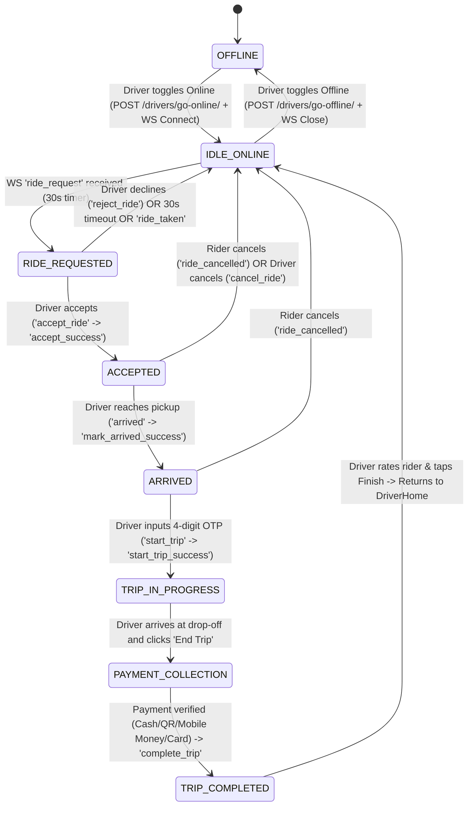
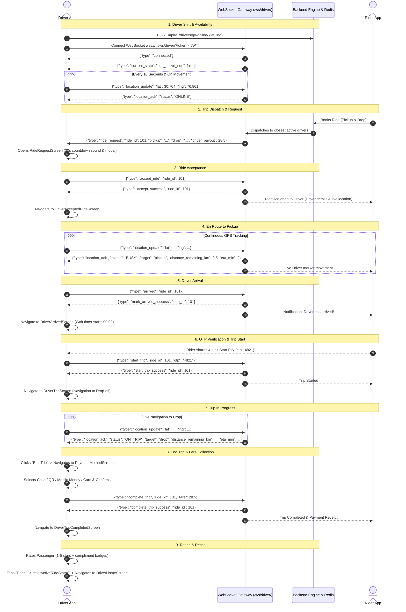

# Driver Booking Flow Specification & Technical Architecture
**Project:** Moto Taxi Solution (Leanvia Uber)  
**Platform:** React Native (iOS & Android) with Django Channels WebSocket & REST API  
**Last Updated:** October 2026  

---

## 1. Executive Summary & Architecture Overview

The Driver Booking Flow represents the end-to-end lifecycle of a trip from the driver's perspective. The architecture combines:
1. **REST APIs:** For authentication, driver shift control (`go-online`, `go-offline`), wallet balances, earnings summaries, and past trip histories.
2. **Full-Duplex WebSockets (`/ws/driver/?token=<JWT>`):** For sub-second bidirectional communication, live GPS tracking, incoming trip dispatching, ride acceptance, status transitions, OTP verification, and trip completion.
3. **Redux Toolkit (`driverSlice`):** Global state store managing connection lifecycle, current location, active trip metadata, and UI transitions.

---

## 2. End-to-End Driver Booking Lifecycle

### 2.1 State Transition Diagram



---

### 2.2 End-to-End Sequence Diagram



---

## 3. Screen-by-Screen Flow & UX Specification

### Screen 1: Driver Home Dashboard (`DriverHomeScreen.js`)
* **Purpose:** Primary command center where the driver manages shifts, views earnings, and waits for bookings.
* **Key Features:**
  * **Online / Offline Toggle:** Calling `POST /api/v1/drivers/go-online/` or `POST /api/v1/drivers/go-offline/`.
  * **Live Map:** Renders current GPS position with bike/car orientation indicator.
  * **Live Heartbeat:** Dispatches `location_update` every 10 seconds over WebSocket while online and idle.
  * **Shift Metrics:** Toggleable periods (Today, Week, All-Time) displaying Online Hours, Rides Completed, and Net Earnings.
  * **Active Trip Banner:** When an active ride exists in Redux (`accepted`, `arrived`, or `in_progress`), clicking the persistent banner instantly resumes the trip screen at the exact current phase.

---

### Screen 2: Incoming Ride Request (`RideRequestScreen.js` / Modal)
* **Trigger:** Triggered automatically when WebSocket message `{"type": "ride_request"}` is received.
* **Key Features:**
  * **30-Second Countdown Timer:** Visual circular bar counting down from 30 to 0 seconds.
  * **Route Overview:** Displays Pickup address, Drop-off destination, estimated distance (km), and travel duration.
  * **Earnings Preview:** Guaranteed driver payout (e.g. `28.50 USD` or `12,500 XAF`).
  * **Passenger Info:** Passenger name, avatar, and overall rider rating (e.g. `★ 4.95`).
  * **Actions:**
    * **Accept Button:** Dispatches `driverAcceptRide({ rideId })` -> Sends `{"type": "accept_ride", "ride_id": id}` -> Navigates to `DriverAcceptedRideScreen`.
    * **Decline Button:** Dispatches `driverRejectRide({ rideId })` -> Sends `{"type": "reject_ride", "ride_id": id}` -> Closes screen back to `DriverHomeScreen`.
    * **Timeout / Taken:** If another driver claims the ride or the 30s expires, receives `{"type": "ride_taken"}` or `{"type": "ride_expired"}` and dismisses cleanly.

---

### Screen 3: En Route to Pickup (`DriverAcceptedRideScreen.js`)
* **State in Redux:** `rideStatus = 'accepted'`
* **Key Features:**
  * **Turn-by-Turn Route:** Map line from current driver GPS coordinates to passenger pickup spot.
  * **Live Distance & ETA:** Computes remaining distance in meters/km and minutes using backend `location_ack` or Haversine formula.
  * **Driver Controls:**
    * **"Call Rider":** Opens native phone dialer with rider's phone number.
    * **"Navigate":** Opens external GPS apps (Google Maps / Waze).
    * **"I've Arrived" Button:** Dispatches `driverMarkArrived({ rideId })` -> Sends `{"type": "arrived", "ride_id": id}` -> Navigates to `DriverArrivedScreen`.
    * **Cancel Ride:** Cancel modal with reason selection (`"Vehicle issue"`, `"Rider no-show"`, `"Accident"`, etc.) sending `{"type": "cancel_ride"}`.

---

### Screen 4: Arrived at Pickup Spot (`DriverArrivedScreen.js`)
* **State in Redux:** `rideStatus = 'arrived'`
* **Key Features:**
  * **Passenger Waiting Timer:** Counts UP from `00:00` (e.g. `02:45`) so driver and system track wait time accurately.
  * **Security Start PIN Box:** 4 individual numeric input boxes for rider's 4-digit OTP.
  * **Start Trip Action:**
    * Driver inputs PIN and taps **"Start Trip"**.
    * Dispatches `driverStartTrip({ rideId, otp })` -> Sends `{"type": "start_trip", "ride_id": id, "otp": "..."}`.
    * On `start_trip_success`: Navigates to `DriverTripScreen`.
    * On `start_trip_failed`: Displays error alert `"Invalid OTP. Please re-enter"` and clears digits.

---

### Screen 5: Trip In Progress (`DriverTripScreen.js`)
* **State in Redux:** `rideStatus = 'in_progress'`
* **Key Features:**
  * **Drop-off Navigation:** Real-time route map leading to passenger's drop-off destination.
  * **Trip Statistics:** Real-time distance remaining (`km`), dynamic ETA (`mins`), and live speed.
  * **Continuous GPS Sync:** Sends `location_update` every 10s and upon GPS movement filter.
  * **Emergency & Safety:** Emergency SOS button and passenger support shortcut.
  * **"End Trip" Button:** When reaching destination, driver taps "End Trip" -> Navigates to `PaymentMethodScreen`.

---

### Screen 6: Fare & Payment Collection (`PaymentMethodScreen.js`)
* **Trigger:** Opened with `isDriver: true` upon ending the trip.
* **Key Features:**
  * **Fare Summary:** Itemized breakdown of base fare, distance rate, waiting time, and total trip charge.
  * **4 Supported Payment Channels:**
    1. **Cash:** Driver collects physical cash and taps `"Confirm Cash Collected"`.
    2. **Dynamic QR Code:** Passenger scans driver's on-screen QR code; real-time polling checks transaction status.
    3. **Mobile Money:** Direct prompt push for African telcos (Orange Money, MTN Mobile Money, Airtel, M-Pesa).
    4. **Credit/Debit Card:** In-app card processing for rider card on file.
  * **Completion Handshake:** Once payment is confirmed, dispatches `driverCompleteTrip({ rideId, fare })` which sends `{"type": "complete_trip", "ride_id": id}` over WebSocket, then navigates to `DriverTripCompletedScreen`.

---

### Screen 7: Trip Completed & Rating (`DriverTripCompletedScreen.js`)
* **State in Redux:** `rideStatus = 'completed'`
* **Key Features:**
  * **Gross Earnings Summary:** Displays final driver payout, tips, surge bonus, distance covered, and trip duration.
  * **Passenger Rating:** 5-star interactive rating system.
  * **Compliment Badges:** Quick selectable tags (`"Polite & Friendly"`, `"Ready on Time"`, `"Respectful Rider"`, `"Generous Tipper"`).
  * **"Done" / Return Home:** Resets active trip state in Redux via `resetActiveRideState()` and resets navigation stack directly back to `DriverHomeScreen`, ready for the next incoming trip.

---

## 4. WebSocket Protocol Specification

### 4.1 Connection Details
* **Base URL:** `ws://<host>/ws/driver/?token=<JWT_ACCESS_TOKEN>` (or `wss://` in production SSL)
* **Auth:** Handled via Query Parameter `?token=<access_token>` during handshake.

### 4.2 Driver-to-Server Messages (Upstream)

| Message Type | Payload Structure | Description |
| :--- | :--- | :--- |
| `online` | `{"type": "online"}` | Sent upon connection to register active driver status |
| `location_update` | `{"type": "location_update", "lat": 30.7046, "lng": 76.8016}` | Periodic (10s) and motion-based live GPS update |
| `accept_ride` | `{"type": "accept_ride", "ride_id": 101}` | Accepts the incoming booking offer |
| `reject_ride` | `{"type": "reject_ride", "ride_id": 101}` | Declines the offer (returns driver to idle) |
| `arrived` | `{"type": "arrived", "ride_id": 101}` | Driver signals arrival at rider pickup point |
| `start_trip` | `{"type": "start_trip", "ride_id": 101, "otp": "4821"}` | Submits rider's 4-digit PIN to start ride |
| `complete_trip`| `{"type": "complete_trip", "ride_id": 101, "fare": 28.5, "lat": ..., "lng": ...}` | Completes the trip at drop-off |
| `cancel_ride` | `{"type": "cancel_ride", "ride_id": 101, "reason": "Vehicle issue"}` | Cancels accepted ride with cancellation reason |

---

### 4.3 Server-to-Driver Messages (Downstream)

| Message Type | Key Payload Fields | Driver App Action |
| :--- | :--- | :--- |
| `connected` | `{"type": "connected"}` | Sets `socketConnected = true` |
| `current_state` | `{"has_active_ride": true, "stage": "...", "ride": {...}, "driver": {...}}` | Hydrates driver status & restores trip on app reconnect/resume |
| `location_ack` | `{"status": "ONLINE\|BUSY\|ON_TRIP", "distance_remaining_km": ..., "eta_min": ...}` | Confirms GPS & updates live distance/ETA |
| `ride_request` | `{"ride_id": 101, "pickup_address": "...", "drop_address": "...", "driver_payout": 28.5}` | Launches `RideRequestScreen` with 30s countdown |
| `ride_taken` / `ride_expired` | `{"ride_id": 101}` | Alerts driver ride was taken/expired & dismisses modal |
| `accept_success` | `{"ride_id": 101, "detail": "Ride accepted"}` | Sets `rideStatus = 'accepted'` -> Navigates to `DriverAcceptedRide` |
| `accept_failed` | `{"ride_id": 101, "detail": "Ride already taken"}` | Displays error banner & resets to idle |
| `reject_success` | `{"ride_id": 101}` | Clears request & resets to idle |
| `mark_arrived_success` | `{"ride_id": 101}` | Sets `rideStatus = 'arrived'` -> Navigates to `DriverArrived` |
| `start_trip_success` | `{"ride_id": 101}` | Sets `rideStatus = 'in_progress'` -> Navigates to `DriverTrip` |
| `start_trip_failed` | `{"ride_id": 101, "detail": "Invalid OTP"}` | Displays alert to re-enter OTP |
| `complete_trip_success`| `{"ride_id": 101}` | Sets `rideStatus = 'completed'` -> Navigates to `DriverTripCompleted` |
| `ride_cancelled` | `{"ride_id": 101, "cancelled_by": "RIDER"}` | Alerts driver rider cancelled, clears active ride, returns to Home |

---

## 5. REST API Endpoints Reference

| Endpoint | Method | Purpose | Key Parameters / Payload |
| :--- | :--- | :--- | :--- |
| `/api/v1/drivers/go-online/` | `POST` | Toggles driver shift online | `{"latitude": 30.7046, "longitude": 76.8016}` |
| `/api/v1/drivers/go-offline/` | `POST` | Toggles driver shift offline | `{}` |
| `/api/v1/drivers/stats/home/` | `GET` | Fetches driver ratings, today/week/all-time hours, rides, and earnings | Auth Header |
| `/api/v1/drivers/wallet/` | `GET` | Current wallet balance & available funds | Auth Header |
| `/api/v1/drivers/wallet/summary/` | `GET` | Breakdown of daily and weekly trip earnings | Auth Header |
| `/api/v1/drivers/wallet/transactions/` | `GET` | Ledger history of trip payouts and withdrawals | `?page=1&page_size=20` |
| `/api/v1/rides/driver-rides/` | `GET` | Paginated list of completed trips | `?page=1&page_size=10` |

---

## 6. Redux State Architecture (`driverSlice.js`)

```typescript
interface DriverState {
  // Shift & Socket
  isOnline: boolean;
  onlineLoading: boolean;
  socketConnected: boolean;
  socketConnecting: boolean;
  socketError: string | null;

  // GPS & Telemetry
  currentLocation: { lat: number; lng: number };
  lastLocationSent: { lat: number; lng: number; timestamp: number } | null;
  lastLocationAck: LocationAckPayload | null;
  distanceRemainingKm: number | null;
  etaMin: number | null;
  target: 'pickup' | 'drop' | null;

  // Ride State Machine
  rideStatus: 'idle' | 'requested' | 'accepted' | 'arrived' | 'in_progress' | 'completed' | 'cancelled';
  incomingRideRequest: RideRequestPayload | null;
  activeRide: ActiveRidePayload | null;
  completedRide: CompletedRidePayload | null;

  // Notices & Alerts
  actionLoading: boolean;
  actionError: string | null;
  actionSuccessNotice: string | null;
  rideTakenNotice: RideTakenPayload | null;
  rideCancelledNotice: RideCancelledPayload | null;

  // Wallet & Stats
  wallet: WalletData | null;
  walletSummary: WalletSummaryData | null;
  homeStats: HomeStatsData | null;
  driverRides: TripRecord[];
}
```

---

## 7. Edge Cases & Resilience Strategy

1. **App Backgrounding or Crash Recovery (`current_state` synchronization):**
   * If driver kills the app or loses cellular connection during a trip, the app immediately reconnects the WebSocket upon launch.
   * The backend responds with a `current_state` packet containing `stage` (`assign`, `arrived`, or `trip_ongoing`) and complete ride details.
   * `driverSlice` immediately detects active trip stage and auto-navigates driver to the exact corresponding screen (`DriverAcceptedRide`, `DriverArrived`, or `DriverTrip`).
2. **WebSocket Auto-Reconnect:**
   * Uses exponential backoff ($1\text{s}, 2\text{s}, 4\text{s}, \dots, \max 10\text{s}$) up to 5 attempts.
   * If a location update is triggered while socket is offline, it is buffered into `pendingLocation` and flushed immediately upon reconnection.
3. **Ghost Rides & Multiple Offers:**
   * When `rideStatus` is active (`accepted`, `arrived`, `in_progress`), incoming `ride_request` socket packets are strictly ignored to prevent disruption.
4. **Debounced GPS Streaming:**
   * High-frequency GPS updates are filtered to prevent network congestion (minimum 1.2s delay and $\approx 4\text{m}$ movement delta threshold).
